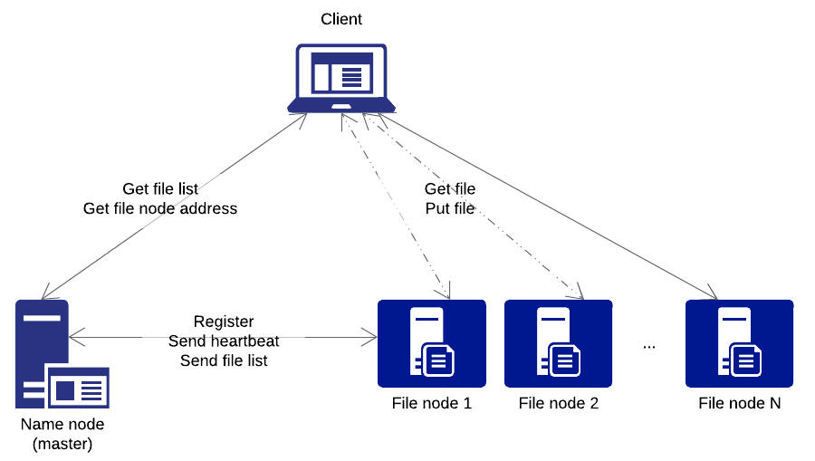
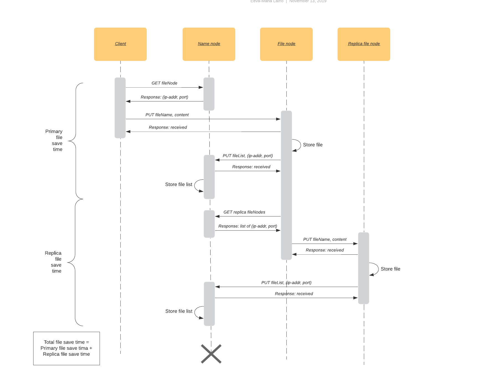

# System design

## Architecture

## Processes

### Logical components

<!--https://www.lucidchart.com/documents/edit/c57d43b0-ede6-4ecb-a284-c0ca66047a74-->

#### Client

* Client software
* Provides access to the distributed file system. 
* There can be many.

##### Communication

| Node from | | Node to | |
| --- | --- | --- | --- |
| Client | HTTP GET | Name Node | Query file node ip-address ad port (for GETting, PUTting a file). Wait for response. The name node responds with an ip-address and port number. |
| Client | HTTP PUT | File Node | Store file on file node. Wait for reponse. File node responses when message is received. Not when file is stored. |
| Client | HTTP GET | File Node | Read file from file node. Wait for reponse. File node responses with the file. |

#### Name Node

* Master node
* Single point of failure
* Always running/listening
* The client's and a (novel) file node's first point of contact
    * Informs the client which file node to use for PUT and GET
    * Adds the (novel) file node as part of the system (i.e. in the node list)
* Maintains a list of files
    * The file nodes inform the name node of their files when there are changes
* Maintains a list of file nodes
    * File nodes register themselves on the name node when they are started
    * File nodes send heartbeats to the name node

###### Name Node -> Client

None

###### Name Node -> File Node

None

#### File Node

* Worker node
* There can be many
* Registers itself on the name node when started
* Handles storing the actual files

###### File Node -> Client

None

###### File Node -> Name Node

* Register (ASYNC)
    * Name node responds with OK
* Send file list (ASYNC)
    * Name node responds with OK
* Send heartbeat (NO RESPONSE)

## Communication

<!--https://www.lucidchart.com/documents/edit/66b3bccc-280f-48a8-b0be-1ba4f7274a9b-->

