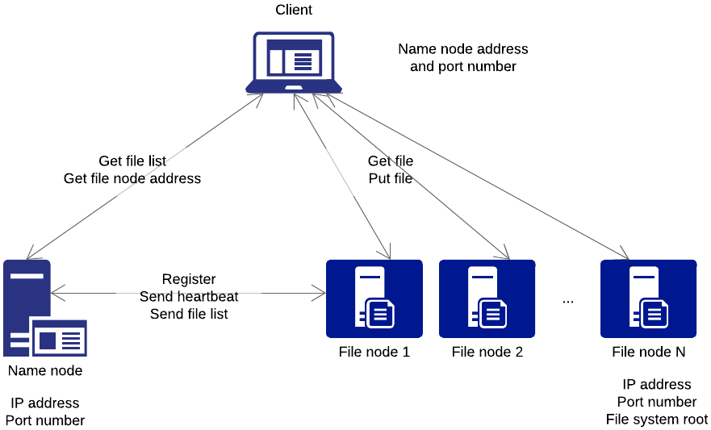
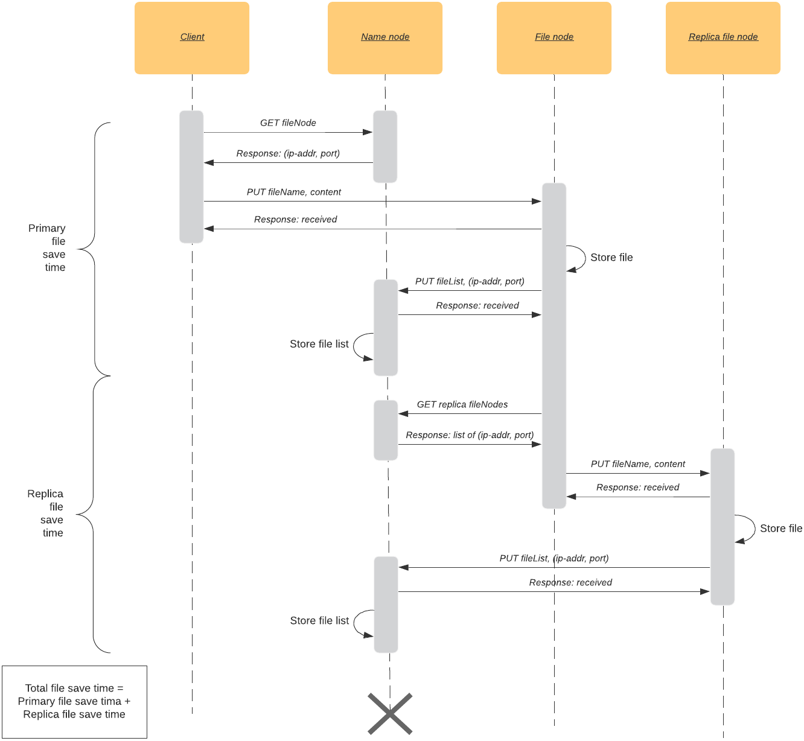

### Project 1, a distributed system
Eeva-Maria Laiho, Jarkko Kovala, Paavo Hemmo

# System design

## Architecture

Our actual dfs system (name node, multiple file nodes) implements a resource-centered (master-worker) architecture where the name node is the central resource (master). The name node's responsibility is to manage the dfs system: keep track of nodes and files in the system, respond to file locaiton queries, detect and react to node failures. The file nodes' (worker) task is to efficiently and reliably store and serve files.

Our dfs client's communication with the dfs system follows client-server model. To carry out one task (store/read a file) the client instantiates two separate connections to the dfs system in a sequence. First to the name node to query file node ip address and port number and then the given file node to store/read a file. 

## Processes / logical components

<!--https://www.lucidchart.com/documents/edit/c57d43b0-ede6-4ecb-a284-c0ca66047a74-->

### Client

* Client software
* Provides access to the distributed file system. 
* There can be many.

#### Communication

| Node from | | Node to | | |
| --- | --- | --- | --- | --- |
| Client | <--> | Name node | HTTP GET | Query file node ip-address ad port (for storing and reading a file). Wait for response. The name node responds with an ip-address and port number. |
| Client | <--> | File node | HTTP PUT | Store file on file node. Wait for reponse. File node responses when message is received. Not when file is stored. |
| Client | <--> | File node | HTTP GET |  Read file from file node. Wait for reponse. File node responses with the file. |

### Name Node

* Master node
* Single point of failure
* Always running/listening
* The client's and a file node's first point of contact
    * Informs the client which file node to use for PUT and GET
    * Adds the file node as part of the system (i.e. in the node list)
* Maintains a list of files
    * The file nodes inform the name node of their files when there are changes
* Maintains a list of file nodes
    * File nodes register themselves on the name node when they are started
    * File nodes send heartbeats to the name node

#### Communication

| Node from | | Node to | | |
| --- | --- | --- | --- | --- |
| Name node | --> | File node | HTTP POST | Tell the file node to replicate certain file to a certain other node. Do not wait for response. For fault tolerance when a file node has failed. |

### File Node

* Worker node
* There can be many
* Registers itself on the name node when started
* After registering sends heartbeat to name node
* Listens to requests from client (store, read a file) and other file nodes (replicate)
* Handles storing and reading files from the file system
* Sends file list updates to name node

#### Communication

| Node from | | Node to | | |
| --- | --- | --- | --- | --- |
| File node | <--> | Name node | HTTP POST | Register file node on name node. Do not wait or response. |
| File node | --> | Name node | HTTP POST | Send file list to name node. Wait or response. |
| File node | --> | Name node | HTTP POST | Send heartbeat to name node. Do not wait or response. |
| File node | --> | File node (replica) | HTTP POST | Send file for replication to another file node. Do not wait or response. |

## Communication

Communication between our dfs client and the actual dfs system (name node, file nodes) as well as between the nodes is handled via HTTP protocol. HTTP protocol was selected primarily for ease of implementation with python programming language. In a real distributed file system a protocol other than HTTP would be more suitable at least for short, frequent messages sent between the nodes for example the heartbeat message. 

The messages sent between system components are described above in the processes section so that under each component a table lists messages sent from that particular componenent to some other component. The arrow column indicates weather a response message is (logically) expected '-->' denotes a one-way message (async) and '<-->' a two-way message (sync). The response messages are not separately listed. Since we're using HTTP (TCP) for all communication the responses are of course always sent (and by default waited). To mitigate this we define a tiny time-out on the sending side to quickly resume execution. The tables are a description of our implementation, not a comprehensive list of all messages sent in a fully functioning distributed file system. 

An example of a communication sequence for storing a single file on the file system is decribed in the following picture.

<!--https://www.lucidchart.com/documents/edit/66b3bccc-280f-48a8-b0be-1ba4f7274a9b-->

