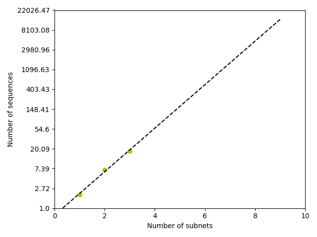
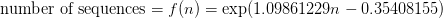
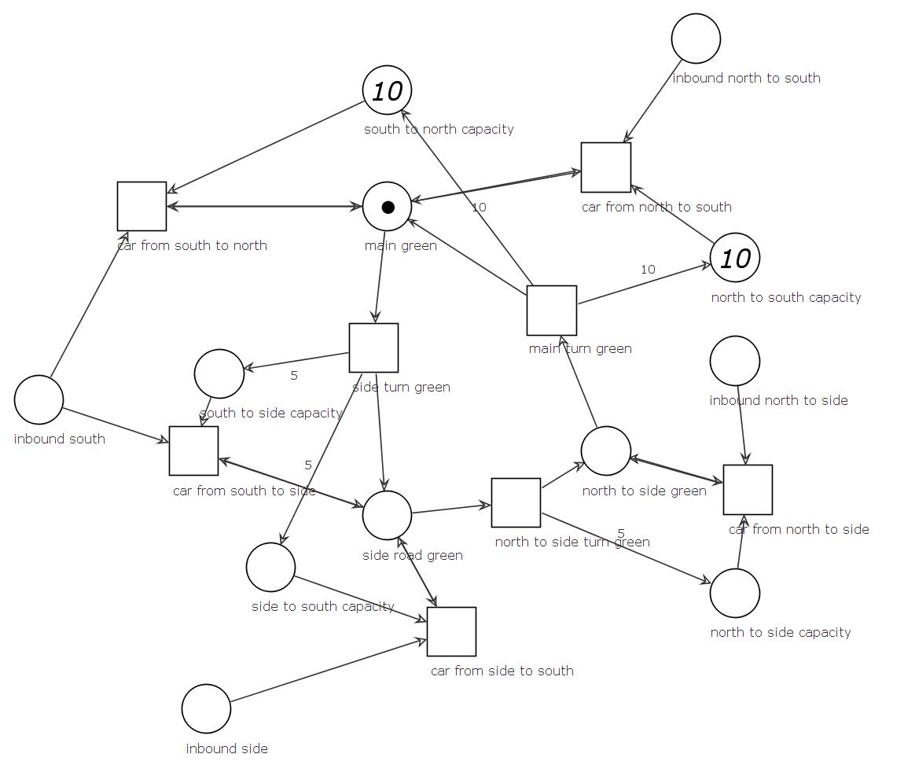

### Group

Eeva-Maria Laiho, Jarkko Kovala, Paavo Hemmo

# Project 2

## Part 1


## Part 2

#### 1. Are these three nets live? Explain how did you check this.

Yes, all of the nets are live. 

A net is live if all of it's transitions are live. A transition is live if it is enabled (=it can fire) by some sequence of transitions. A transition's liveness can be shown for example by finding a sequence of transitions that enables it. In this case for all nets all transitions are enabed by executing the shortest transition sequences from the initial state to goal state of subtask 3. 

#### 2. Are these nets bounded? Explain how did you check this.

Yes, all of the nets are bounded.

A net is ```k```-bounded if in all it's reachable markings there is ```k``` so that the amount of tokens in any place is less than or equal to ```k```. If ```k=1``` the net is safe. If a net is ```k```-bounded it's bounded. In this case for all nets at any reachable marking the amount of tokens in any place is 0 or 1. Thus the nets are 1-bounded. This can be checked by looking at the transitions. For all transitions in all nets the amount of incoming and outgoing arcs is the same. The nets cannot duplicate or destroy tokens. They are bounded.


#### 3. For each of these nets, what is the length of the shortest firing sequence that leads to a marking in which all odd-numbered places have a token? 

The number of transitions are 2, 7 and 18 for nets 1, 2, and 3 respectively.

The shortest firing sequence can be found by building a reachability graph and tracing back the shortest sequence from the goal marking to the initial marking. For nets with small reachability graph a graphical tool would suffice. For larger reachability graph sizes utilizing a shortest path algorithm would be a good choise.  

#### 4. Can you say something about the length of the shortest path that leads to a marking in which all odd-numbered places have a token?

The length of the shortest sequence to goal state seems to grow rapidly as the number of subnets increases. Growth seems to be exponential. The figure below visualizes the relation between number of subnets (x) and number of transitions (y) in the shortest sequence and a log-linear curve fitted on the data. 



The estimated number of required transitions in the shortest sequence from initial state to goal state can be expressed with formula: 



where n is the amount of subnets.


## Part 3



The picture depicts a petri net model for Kumpula traffic lights.

The lights have three possible states:

* Initial state in which traffic is possible in the north-south direction
* Second state in which traffic is possible in the south to side road and side road to south directions
* Third state in which traffic is possible in the north to side road direction

The lights are green in the directions allowed and red in other directions, lights are orange when changing state from green to red but orange lights are not modelled to keep the graph size down. As depicted in the picture in the task description, traffic in the side road to north direction is not possible.

The singular token depicts change of the lights between the three states. The "capacity" places depict the capacity to accept cars in a direction, and are refilled by the light turning green in that particular direction. Since WoPeD does not support a reset arc, it is not possible to model resetting the capacities: instead in this graph the weighted arc to the "capacity" place means setting the number of tokens to the amount determined by the weight.

The "inbound" places depict cars coming from each direction. A new car coming to the intersection would be represented by adding a token in an "inbound" place. The "car from" transitions represent cars moving from a direction to another: this transition is possible only if the light is green in that direction, as it consumes and produces a token with a two-way arc to the appropriate "green" place. It also consumes a token from the "capacity" state, limiting the number of cars that may proceed in that particular direction.


