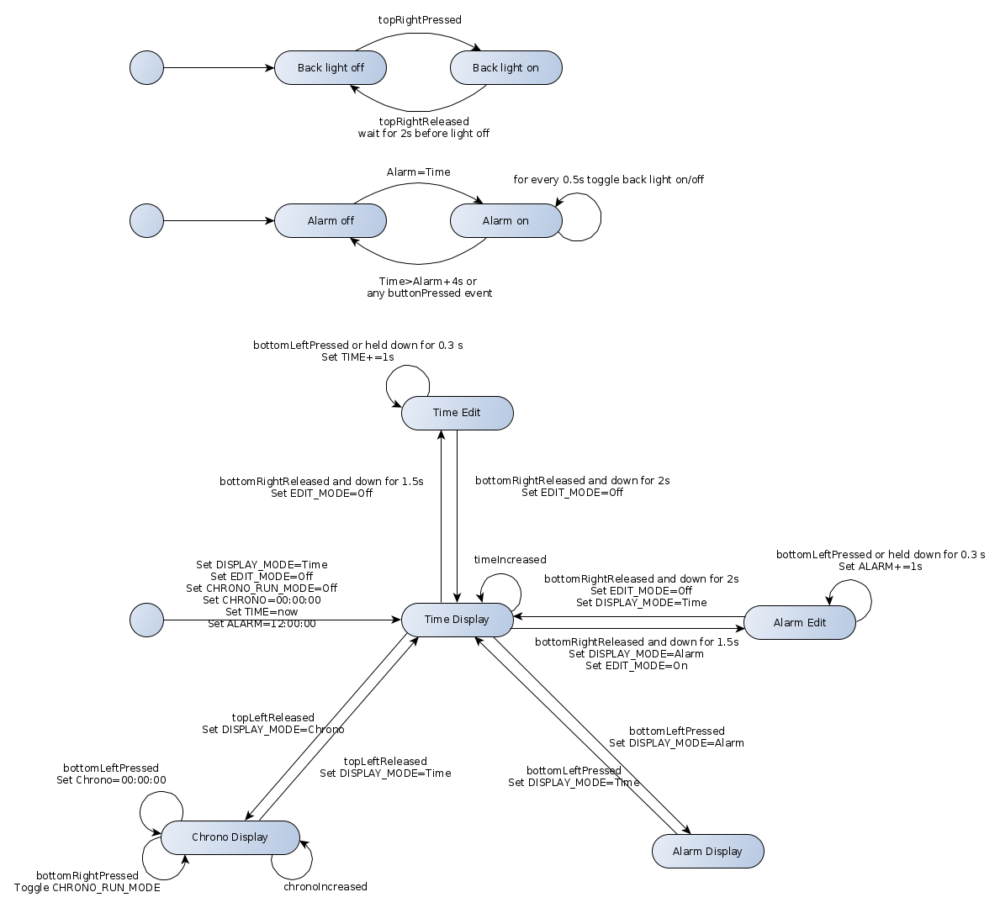

### Group

Eeva-Maria Laiho, Jarkko Kovala, Paavo Hemmo

# Project 3

## State chart

Digital watch state chart is divided in three parts. 
* The first part describes the back light on/on operation. The back light can be toggled on/off from any watch state. Toggling the back light on/off is independent of the main watch funcitonality.
* The second part describes the alarm on/on operation. Similar to back light alarm can fire from any watch state and it's independent from main watch functionality.
* The third part describes the main watch functionality.

The topLeftPressed event is not displayed in the chart since it has no functionality attached to it. Releasing the top left button alternates between chrono and time display mode. Pressing the button does nothing.

The original state chart for the digital watch is displayed above. The state chart may not be one-to-one with the implementation. Due to time-constraints for the project and other student work updating implementation-time modifications on the chart was not feasible. 

## Implementation

Something something something.
